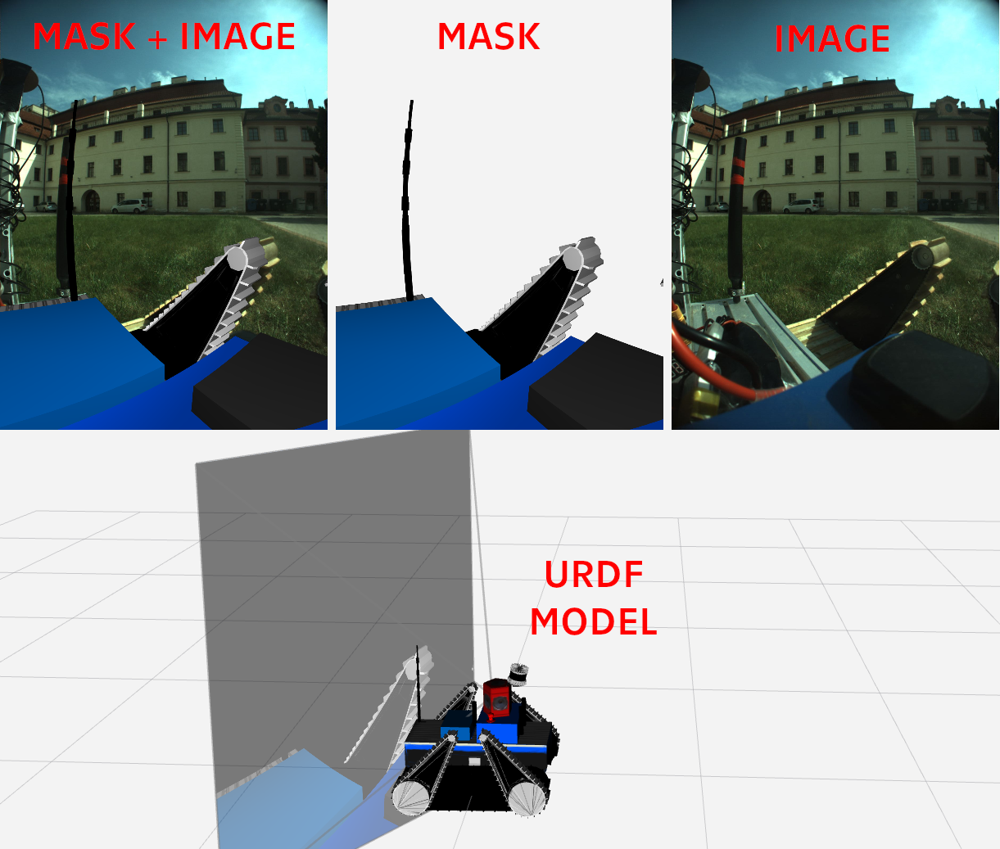

<!-- SPDX-License-Identifier: BSD-3-Clause -->
<!-- SPDX-FileCopyrightText: Czech Technical University in Prague -->

# robot\_model\_renderer

Render or mask out URDF robot model from the camera view.

This package provides a node or nodelet that generates synthetic images of the robot as seen from a specified camera
viewpoint, useful for self-filtering, occlusion detection, and robot awareness applications.

## Features

- Renders robot model from URDF using OGRE 3D engine
- Supports multiple rendering modes (normal (visual or collision mesh), solid shaded color, binary mask)
- Camera distortion simulation (can render both rectified and distorted images)
- Outline rendering for enhanced visibility
- Supports adding static overlay from image file as either foreground or background
- Real-time TF-based robot pose updates
- Configurable clipping distances and image processing



## Important Note

> [!WARNING]
> To manage reasonable performance, this packages does the rendering on a GPU via OpenGL.
> Therefore, for the library to work, you need a running X server (or XWayland).
> 
> If you have a running X window server, but it is not accessible in the console from which you run the node (e.g.
> because you ssh'd to the robot), just set the `DISPLAY` environment variable to the handle of your running X server
> (usually `:0` or `:1`):
> 
>     DISPLAY=:0 rosrun robot_model_renderer robot_model_renderer
> 
> If you don't have a running X server and don't want or can't set it up (e.g. in CI or
> on headless robots), prefix the node run command with `xvfb-run -a` from package `xvfb`.
> However, Xvfb does software rendering, which is inefficient. If you have a GPU, you can convince Xvfb to do GPU
> rendering using VirtualGL:
> 
>     vglrun +v -d /dev/dri/card0 xvfb-run -a rosrun robot_model_renderer robot_model_renderer
> 
> If you run this library as nodelet, this prefixing needs to be done on the side of the nodelet manager.

## Node `robot_model_renderer` and nodelet `robot_model_renderer/robot_model_renderer_nodelet`

### Topics

#### Subscribed
- `camera_info` (sensor_msgs/CameraInfo): Camera parameters for rendering viewpoint

#### Published
- `mask` (sensor_msgs/Image): Rendered robot model image

### Parameters

#### Core Parameters

- `robot_description` (string, required): URDF robot model description
- `~image_encoding` (string, default: "bgr8"): Output image encoding (color/mono encodings supported)
- `~rendering_mode` (string, default: "normal"): Rendering mode
  - `"normal"`: Standard textured rendering according to the URDF model
  - `"color"`: Render all links using a shaded solid color (`~color_mode_color`)
  - `"mask"`: Render all links using a non-shaded white mask

#### Camera & Rendering

- `~near_clip` (double, default: 0.01 m): Near clipping plane distance
- `~far_clip` (double, default: infinite): Far clipping plane distance
- `~render_image_scale` (double, default: 1.0): Scaling factor for rendered image. Set lower than 1 to decrease the
                                                resolution of the rendered image.
- `~max_render_image_size` (uint, default: 0 px): Maximum render texture size (0 px = GPU limit). Set to lower
                                                  values to decrease the resolution of the rendered image.
- `~upscaling_interpolation` (string, default: "INTER_LINEAR"): OpenCV interpolation method for upscaling when the
                                                                rendered image is smaller than camera info size.
- `~rendered_image_is_static` (bool, default: false): Enable caching of rendered images for identical camera geometry.
                                                      When true, subsequent camera infos with identical camera geometry
                                                      will reuse the last rendered image without triggering rendering or
                                                      TF lookups, but output images will have correct timestamps. Use
                                                      this when the visible parts of the robot do not move.

#### Lens Distortion

- `~do_distort` (bool, default: true): Enable camera distortion correction (true = distorted image, false = rectified)
- `~gpu_distortion` (bool, default: true): Use GPU-accelerated distortion (faster). Should generally be okay, but may
                                           produce slightly different results than the original image_geometry code.

#### Visual Appearance

- `~background_color` (float[4], default: [0,0,0,0]): Background color (RGBA, 0-1). This is the color of all parts of
                                                      the image where there is no robot part.
- `~color_mode_color` (float[4], default: [1,1,1,1]): Solid color for "color" rendering mode (RGBA, 0-1).
- `~visual` (bool, default: true): Show visual geometry.
- `~collision` (bool, default: false): Show collision geometry.

#### Outline Rendering

- `~draw_outline` (bool, default: false): Draw object outlines.
- `~outline_width` (double, default: 2.0): Outline thickness in pixels (may not be precise).
- `~outline_color` (float[4], default: [1,1,1,1]): Outline color (RGBA, 0-1).
- `~outline_from_closest_color` (bool, default: false): Use closest pixel color for outline instead of `~outline_color`.

#### Color Processing

- `~invert_colors` (bool, default: false): Invert output colors (without alpha channel)
- `~invert_alpha` (bool, default: false): Invert alpha channel

#### Static Mask Overlay

- `~static_mask_image_file` (string, default: no image): Path to static mask image file
- `~static_mask_image_encoding` (string, default: auto-detect): Encoding of mask image (see sensor_msgs/Image/encoding)
- `~static_mask_is_background` (bool, default: false): Treat mask as background (true) or foreground (false)

#### Transform & Timing

- `~tf_timeout` (double, default: 1.0, units: s): TF lookup timeout
- `~all_links_required` (bool, default: false): Require all links to have valid transforms
- `~required_links` (string[], default: empty): Set of link names that must have valid transforms

#### Shape Names and Name Templates

The `~only_shapes`, `~ignored_shapes` and `~body_model/inflation/per_shape` configs reference individual model parts.
These can be referenced by various names and name templates (`link` is the name of a link, `shape` is the name of a
visual or collision element, `shape#` is the ordinal number of the visual/collision in its link):

- `link` (match all shapes in the link with name `link`)
- `*::shape` (match all shapes with name `shape` in any link)
- `link::shape#` (match the `shape#`-th visual or collision in the given link)
- `link::shape` (match shape with name `shape` in link with name `link`)
- `*:visual:shape` (match visual with name `shape` in any link)
- `link:visual:shape#` (match `shape#`-th visual in link with name `link`)
- `link:visual:shape` (match visual with name `shape` in link with name `link`)
- `*:collision:shape` (match collision with name `shape` in any link)
- `link:collision:shape#` (match `shape#`-th collision in link with name `link`)
- `link:collision:shape` (match collision with name `shape` in link with name `link`)

Note: This syntax is similar to [robot_body_filter](https://github.com/peci1/robot_body_filter). But robot_body_filter
does not support the `:visual:` and `:collision:` selectors.

#### Shape Filtering

- `~ignored_shapes` (string[], default: empty): Link/shape names to ignore (see above)
- `~only_shapes` (string[], default: render all): Only render these shapes (see above)

#### Scaling and Padding of Individual Body Parts

- `~body_model/inflation/scale` (double, default: 1.0): Global scaling factor for all shapes
- `~body_model/inflation/padding` (double, default: 0.0, units: m): Global padding for all shapes
- `~body_model/inflation/per_shape/scale` (dict[string,double]): Per-shape scaling overrides (see above)
- `~body_model/inflation/per_shape/padding` (dict[string,double], units: m): Per-shape padding overrides (see above)

## Other APIs

The package also provides C++, C and Python APIs to its core functionality.

This example Python script reads the robot's URDF from a file, sets camera info and the required transforms, and then
receives the rendered robot image for the camera info's timestamp.

```python
from robot_model_renderer import RobotModelRenderer, RobotModelRendererConfig, RenderingMode
from cv_bridge import CvBridge
from geometry_msgs.msg import TransformStamped
from rospkg import RosPack
from sensor_msgs.msg import CameraInfo
import cv2
import os
import rospy

cv_bridge = CvBridge()

cam_info = CameraInfo()
cam_info.header.frame_id = "link1"
cam_info.header.stamp = rospy.Time(0, 1)
cam_info.height = 1616
cam_info.width = 1212
cam_info.distortion_model = "plumb_bob"
cam_info.D = [1.0, 0, 0, 0, 0, 0.5, 0, 0]
cam_info.K = [800.0, 0.0, 600.0, 0.0, 800.0, 800.0, 0.0, 0.0, 1.0]
cam_info.R = [1.0, 0.0, 0.0, 0.0, 1.0, 0.0, 0.0, 0.0, 1.0]
cam_info.P = [800.0, 0.0, 600.0, 0.0, 0.0, 800.0, 800.0, 0.0, 0.0, 0.0, 1.0, 0.0]

tf = TransformStamped()
tf.header = cam_info.header
tf.child_frame_id = "link2"
tf.transform.translation.x = 0.3
tf.transform.translation.z = 1.0
tf.transform.rotation.w = 1.0

with open(os.path.join(RosPack().get_path("robot_model_renderer"), "test", "robot.urdf"), 'r') as f:
    model = f.read()

config = RobotModelRendererConfig()
config.renderingMode = RenderingMode.COLOR
r = RobotModelRenderer(model, config, "rgba8")

success = r.updateCameraInfo(cam_info)
success = r.setTransform(tf, "test", isStatic=True)

image, errors, link_errors = r.render(cam_info.header.stamp)

if image is not None:
    cv_image = cv_bridge.imgmsg_to_cv2(image)
    cv2.imshow("test", cv_image)
    cv2.waitKey(0)
else:
    for error in errors:
        rospy.logerr(error)
```
